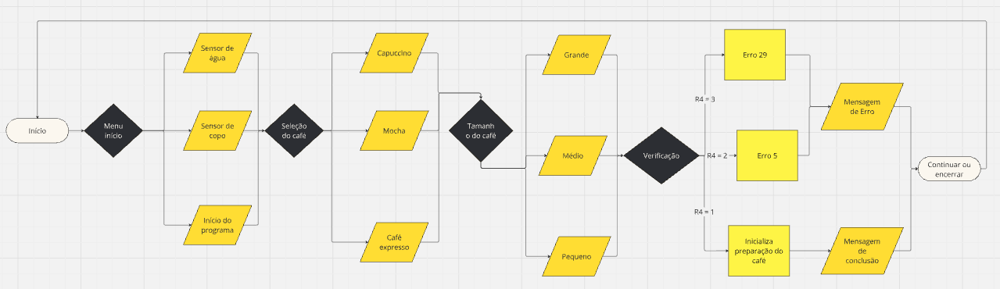
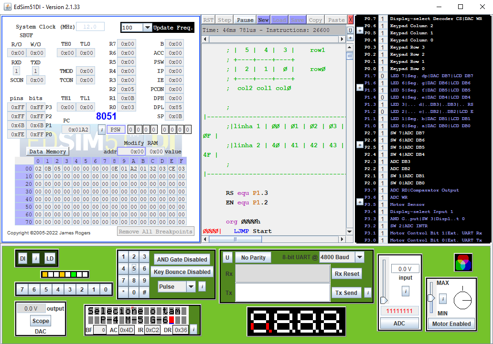

 
  
  # Máquina Café 
  

O projeto visa contemplar todos os conceitos vistos durante o semestre da disciplina de Arquitetura de Computadores. Neste trabalho era necessário utilizar os periféricos do simulador edsim51 para implementar algo de tema livre. O meu grupo escolheu a máquina de café. Vale lembrar que para o projeto era obrigatório o uso do simulador edsim51.

## Fluxograma do programa

## Diagrama esquemático

## Simulação na IDE

Mensagem inicial do programa.

Mensagem indicando qual botão apertar para selecionar o café.

Mensagem informando os possíveis botões para selecionar o tamanho do café.

Mensagem avisando que o café está sendo feito e o motor girando.

Mensagem avisando que o café está pronto e o motor para.

