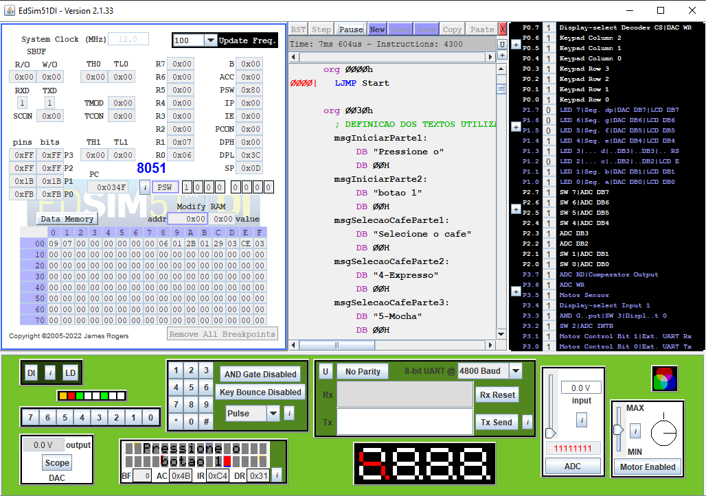

 
  
  # Máquina Café 
  

O projeto visa contemplar todos os conceitos vistos durante o semestre da disciplina de Arquitetura de Computadores. Neste trabalho era necessário utilizar os periféricos do simulador edsim51 para implementar algo de tema livre. O meu grupo escolheu a máquina de café. Vale lembrar que para o projeto era obrigatório o uso do simulador edsim51.

## Fluxograma do programa

## Diagrama esquemático

## Simulação na IDE

